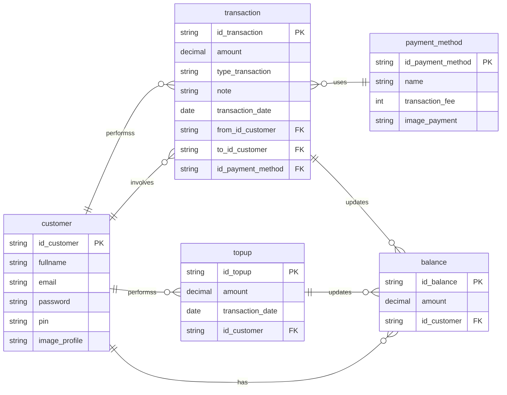

# ERD E-Wallet

This project, presents an Entity-Relationship Diagram (ERD) for an E-Wallet system using the Mermaid diagramming tool.

```mermaid
erDiagram
    direction LR
    customer ||--o{ transaction : performss
    customer ||--o{ transaction : involves
    customer ||--o{ topup : performss
    customer ||--o{ balance : has
    topup ||--o{ balance : updates
    transaction }o--|| payment_method : uses
    transaction ||--o{ balance : updates

    customer {
        string id_customer PK
        string fullname
        string email
        string password
        string pin
        string image_profile
    }
    transaction {
        string id_transaction PK
        decimal amount
        string type_transaction
        string note
        date transaction_date
        string from_id_customer FK
        string to_id_customer FK
        string id_payment_method FK
    }
    topup {
        string id_topup PK
        decimal amount
        date transaction_date
        string id_customer FK
    }
    payment_method {
        string id_payment_method PK
        string name
        int transaction_fee
        string image_payment
    }
    balance {
        string id_balance PK
        decimal amount
        string id_customer FK
    }
```
